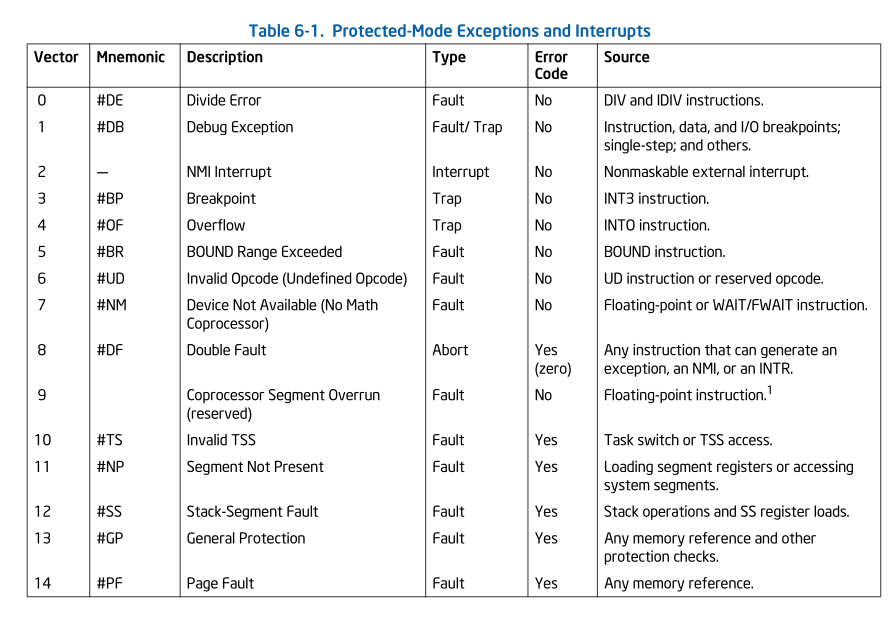
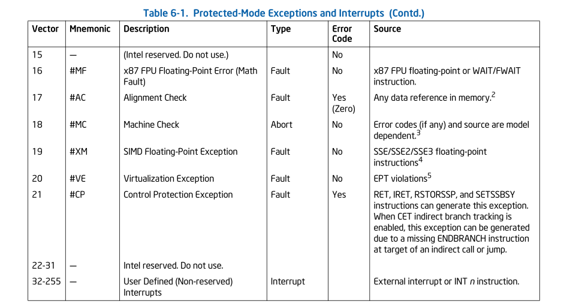

The 80386 processor classifies exceptions into three distinct categories based on how they are reported and whether the instruction that caused them can be restarted. CPU execute the IDT handler based on the vector number

## The 80386 Exception Table (Vectors 0–31)

The first 32 entries of the IDT are reserved by Intel for these exceptions. 

## 1. Faults

Faults are exceptions detected either before or during the execution of an instruction. These typically occur when a condition prevents the instruction from completing successfully.

* **Examples:** Divide Error (#DE), Segment Not Present (#NP), Stack Fault (#SS), and General Protection Fault (#GP).
* **The Action:** The processor saves the machine state such that the return address (CS:EIP) points to the **instruction that caused the fault** and jump to the handler
* **Recovery:** After the operating system kernel handles the underlying issue (such as loading a missing segment from disk), the processor can re-attempt the exact same instruction.

### Page Fault (Vector 14)

This is the engine of modern operating systems. When a program tries to access memory that isn't mapped, the CPU stops it.

* **The Linux Reaction:** The kernel looks at the address in the **CR2** register. It then loads the missing page from the disk (swap/executable) into RAM, updates the Page Tables, and tells the CPU: "Try that instruction again."

###  General Protection Fault (Vector 13)

This is the "Security Guard." It triggers if:

* A program tries to jump to a segment it doesn't have permission for.
* A program tries to write to a Read-Only segment.
* A program tries to execute a privileged instruction (like `HLT`) while in Ring 3.
* **The Linux Reaction:** Usually results in the famous "Segmentation Fault" and the kernel kills the process.

### Levels of fault

1. Level 1: Single Fault
    - When it happens: A normal error occurs. For example, DIV by zero, or a Page Fault (trying to access memory not in RAM).
    - Recoverable? Yes. This is the primary job of an OS.

2. Level 2: Double Fault
    - When it happens: The CPU is already trying to handle a fault, and a second fault happens during that process.
        Example: A Page Fault happens, but when the CPU tries to push the registers onto the stack, it finds the stack is missing.
    - How we know: The CPU stops trying to find the first handler and jumps to Vector 8.
    - Recoverable? Barely. Usually, the system is too unstable to continue. Linux 0.12 will print "Double Fault" and halt.
    - Where it logs: To the screen (VGA buffer) via a "Kernel Panic."

3. Level 3: Triple Fault
    - When it happens: The CPU is trying to handle a Double Fault, and a third fault happens.
        Example: The Double Fault handler's code is also missing, or the IDT is completely corrupted.
    - How we know: We don't see a message. The computer instantly reboots.
    - Recoverable? No. The hardware gives up.
    - Where it logs: inside system no where, if we use emulator then we can use emulator's log

    To understand a Triple Fault, look at the three-step sequence of failure:

    1. **The First Fault:** A normal error occurs (e.g., a **Divide by Zero**). The CPU looks in the IDT to find the handler.
    2. **The Double Fault (#DF, Vector 8):** While the CPU is trying to call the Divide by Zero handler, it hits another error. For example, the **IDT itself** is in a memory page that isn't present in RAM. This triggers a "Double Fault."
    3. **The Triple Fault:** While the CPU is trying to call the **Double Fault handler**, it hits a *third* error (e.g., the Double Fault handler's stack is invalid).

    At this point, the CPU "gives up." It stops executing, pulls the **RESET** pin on the motherboard, and the machine restarts.

## 2. Traps
Detected after the instruction executes.

* **Examples:** Debug Trap (single-stepping) and the `INTO` (Overflow) instruction.
* **The Action:** The processor saves the machine state such that the return address (CS:EIP) points to the **instruction immediately following** the one that caused the trap.
* **Recovery:** Since the offending instruction has already finished execution, the program continues forward once the handler finishes.

## 3. Aborts

Aborts are severe exceptions that indicate a hardware error or an inconsistency in system tables that makes it impossible to locate the starting point of the error.

* **Examples:** Double Fault (#DF) and Coprocessor Segment Overrun.
* **The Action:** The processor does not report the precise location of the instruction that caused the error. It may not be possible to restart the program or even the task.
* **Recovery:** The operating system usually terminates the current task or halts the entire system to prevent data corruption.

## infos

1. **panic**
    - panic() is the kernel's "Self-Destruct" button. It is a software function used when the kernel encounters a situation so severe or illogical that continuing execution would risk corrupting data or destroying hardware.
    - Panic is a software decision: "I don't know what to do next, so I'm stopping."
    **What it will do?**
    1. The kernel stops scheduling other tasks.
    2. It prints the string passed to it (the reason) to the console `panic("Error Message")`.
    3. The CPU enters a "dead" state. It doesn't shut down the computer; it just sits in a loop forever doing nothing.

    **Common panic**
    * Root Filesystem Issues: If the kernel can't find the hard drive or floppy disk to load the first program (init), it calls panic("VFS: Unable to mount root fs").
    * Out of Memory: If the kernel's own internal memory structures are full and it can't even start the basic system, it panics.
    * if a Double Fault occurs, the handler calls `panic("Double fault")`.

2. **The Error Code**
When an exception condition is related to a specific segment selector or IDT vector, the processor pushes an error code onto the stack of the exception handler

**Regular error code**
The error code resembles a segment selector; however, instead of a TI flag and RPL field, the error code contains 3 flags:
1. EXT (External event (bit 0)):
    - if set 1
        The exception was not the fault of the instruction currently executing. It happened because of an "external event" that interrupted the flow.
        * Hardware Interrupts: A piece of hardware (like a keyboard or a hard drive) sent a signal while the CPU was trying to do something else.
        * Nested Exceptions: The CPU was already busy trying to deliver one exception, and another one happened during that process.
    - if set 0
        The exception was internally generated by the program itself.
        * Software Interrupts: The code explicitly called for an interrupt using commands like INT n, INT3 (a breakpoint), or INTO (overflow check).
        * Direct Errors: The specific line of code the CPU just processed is what caused the fault (e.g., dividing by zero).
2. IDT (Descriptor location (bit 1)):
    - if 1, index portion of the error code refers to a gate descriptor in the IDT.
        * External Interrupts: A hardware device triggers an interrupt, but the IDT entry for that interrupt is invalid or points to a non-existent segment.
        * Software Interrupts: The code executes INT n, but the entry n in the IDT is "Not Present" (P flag is 0) or contains a limit violation.
        * Double Faults: The CPU tries to handle an exception, but the gate in the IDT required to handle that exception is broken.
    - if 0, indicates that the index refers to a descriptor in the GDT or the current LDT.
        * Segment Switching: Try to load a segment selector (like into the DS, ES, or SS registers) that points to a bad entry in the GDT/LDT.
        * Privilege Violations: Our code tries to access a "Ring 0" (Kernel) segment while running in "Ring 3" (User mode).
        * Stack Faults: The stack segment descriptor in the GDT is marked as invalid.
3. TI (GDT/LDT (bit 2)): **Only used when the IDT flag is clear**
    - If 1, indicates that the index portion of the error code refers to a segment or gate descriptor in the LDT
    - If 0, indicates that the index refers to a descriptor in the current GDT.
4. Index:
    - 13-bit selector index. The segment selector index field provides an index into the IDT, GDT, or current LDT to the segment or gate selector being referenced by the error code.
    - In some cases the error code is null (all bits are clear except possibly EXT). A null error code indicates that the error was not caused by a reference to a specific segment or that a null segment selector was referenced in an operation.

**Page-Fault error**
The error code tells the handler what the CPU was trying to do. It does not tell the handler what the Page Table allows.
1. P flag (bit 0) : 
    - 0 : The page is not in physical memory.
    - The page is present, but permissions were violated.
2. W/R (bit 1): 
    - The access was a Read operation.
    - The access was a Write operation.
3. U/S (bit 2):
    - The access occurred in Supervisor mode.
    - The access occurred in User mode.
4. remaining are reserved