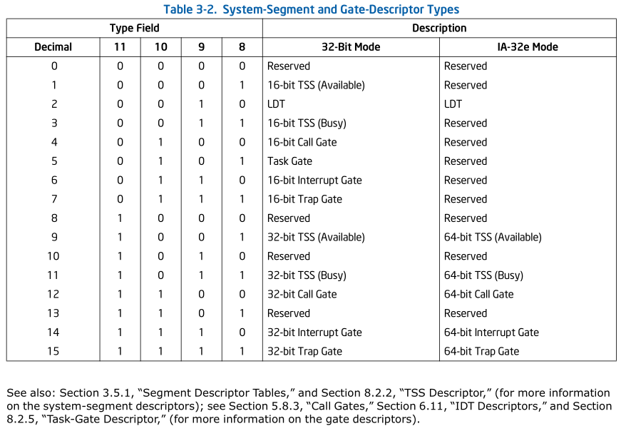
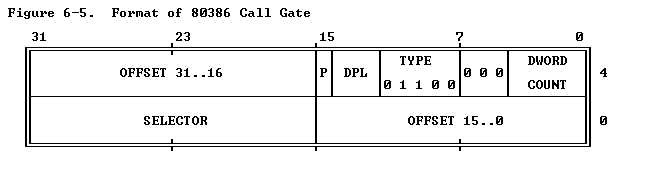

[Refer](https://pdos.csail.mit.edu/6.828/2004/readings/i386/s05_01.htm)
[Refer](https://tldp.org/LDP/khg/HyperNews/get/memory/80386mm.html)
[Refer](https://cdrdv2-public.intel.com/825743/325462-sdm-vol-1-2abcd-3abcd-4.pdf)

In the 8086 architecture, memory management used a straightforward process known as Real Mode. Segment registers, such as the Data Segment (DS) or Code Segment (CS), acted as simple numerical pointers. To calculate a physical memory address, the system shifted the segment value left by 4 bits and added an offset.

While this method was computationally simple, it offered no security. Every program had the ability to access and modify any part of the system’s memory, which often led to instability and system crashes.

The introduction of the 80386 processor brought "Law and Order" to memory management through the Descriptor Table (GDT/LDT). This table serves as a central database that defines the characteristics of various memory segments.

**Memory capacity**
1. The Hardware Limit (Total Physical Memory)
    The 80386 has a 32-bit address bus. Mathematically, $2^{32}$ bytes equals exactly 4GB. This is the absolute maximum amount of physical RAM the processor can electrically talk to. No matter how many processes you run, they are all competing for space within that same 4GB of physical wires.
2. The Process Perspective (Virtual Memory)
    Through the magic of Segmentation and Paging (which the 80386 introduced to the x86 line), the CPU allows each process to act as if it has its own private 4GB address space.
    - Virtual Address Space: Every process "sees" a flat memory map from 0x00000000 to 0xFFFFFFFF.
    - Isolation: Process A can store data at address 0x1234, and Process B can also store different data at address 0x1234. The CPU and the OS map these "virtual" addresses to different "physical" locations in the RAM.

    If you run ten 1GB processes, the OS moves inactive "pages" of memory to the hard drive to free up the physical 4GB.

**Selector**

Even though the CPU is 32-bit, Segment registers are only 16-bit long, the segment registers contains selectors, the selector only needs 16 bits because it isn't a memory address anymore, it's a pointer to a Descriptor Table. 

Instead of pointing directly to a memory location, the segment registers in the 80386 act as index (selectors) that point to an entry in the GDT. 

- Index (Bits 15–3): These 13 bits select one of $2^{13}$ (8,192) possible descriptors in the table.
- TI - Table Indicator (Bit 2): 
    1. `0` = Global Descriptor Table (GDT)
    2. `1` = Local Descriptor Table (LDT)
- RPL - Requested Privilege Level (Bits 1–0): Indicates the priority level (Ring 0 to Ring 3).

## Global Descriptor Table (GDT)

Each entry, or descriptor in GDT contains critical information:

Each entry in this table is 8 bytes long and is called a Segment Descriptor.

- Base Address(32bit): It tells the CPU exactly where in the 4GB RAM the segment starts.
- Limit(20bit): This defines how "long" the segment is. On the 8086 Segments were always 64KB., On the 386 it is flexible. If  the limit to 0x100, that segment is only 256 bytes long. If a program tries to access byte 0x101, the CPU triggers a General Protection Fault.
- The Flags
    - The G (Granularity) Bit
        Since the Limit is only 20 bits, the maximum number you can represent is about 1 Million ($2^{20}$). How do we define a 4GB segment then?
        - If G = 0: The limit is in bytes. (Max size: 1MB).
        - If G = 1: The limit is in 4KB Pages. (Max size: $1MB \times 4KB = 4GB$).
        
    - Access Bytes: 
        - P (Present): 1 this segment actually in RAM (Used for Virtual Memory/Swapping).
        - DPL (Descriptor Privilege Level): 2 bits that define the "Ring."
        - S (System): 0 for system descriptors (like TSS), 1 for code/data segments.
        - A (Accessed): The CPU sets this bit to 1 automatically whenever it accesses that segment
        - AVL (Available) :  Available for use by system software.
        - X (Executable): 
            - X = 1: This is a Code Segment. Only readable
            - X = 0: This is a Data Segment. You can read/write to it, but if you try to point the Instruction Pointer (EIP) here, the CPU will trigger a crash.
        - O (Reserved/Zero): reserved these for future processors
        - TYPE: Distinguishes between various kinds of descriptors.
            1. S = 1
                - Bit 3 (E)Executable :  For data segments, this is always 0. For code segments, this is always 1.
                - Bit 2 :
                    - Data segment : Expansion Direction(ED) : 0 for normal (grows up), 1 for stack-style (grows down).
                    - Code segment : Conforming (C) : 0 means the code can only be executed by a process with the same privilege level; 1 allows execution from lower privilege levels.
                - Bit 1 : 0 for Read-Only, 1 for Read/Write.
                    - Data segment : Write-Enable (W) : 0 for Read-Only, 1 for Read/Write.
                    - Code segment : Read-Enable (R) : 0 for Execute-Only, 1 for Execute/Read.
                - Bit 0 : Accessed(A): 0 is Segment not accessed, 1 is Segment accessed
            2. S = 0
                

**How it works?**

1. The Index is Multiplied: The processor takes the Index from the selector and multiplies it by 8 (since each GDT entry is 8 bytes long).
    - CS = 0000 0000 0100 0000
    - Index = 0000 0000 0100 0 
    - TI = 0 (GDT)
    - RPL = 00 
        - Index  = 0000 0000 01000 says it is eight's entry multiply by 8
        - 0000000001000 *  00000000000000000000000000001000 = 0000 0000 0000 0000 0000 0000 0100 0000 = 64 (10) = 40 (16)
    - EIP = 0000 0000 0000 0000 0000 0001 0000 0000 

2. The GDTR is Consulted: The processor refers to the GDTR (Global Descriptor Table Register), a special register that holds the starting physical address of the GDT itself.
    - GDTR points to address 0 
3. The Descriptor is Fetched: The processor adds the multiplied index to the GDT's base address to find the exact Descriptor for that segment.
    - GDTR (0) + index (40) = 40
    - Logical address = Selector:offset =  0x0040 : 0x00000100
4. Verification: Before allowing access, the CPU checks the "Access Rights" and "Limit" stored in that descriptor against the requested operation.
    - RPL = 00 and if DPL is 00 or 10 or 10 or 11 it is allowed because 00 is high priority
5. Address Formation: If the check passes, the Base Address from the descriptor is added to the program's Offset to create the final linear address.
    - Take the base address for eg: `0101 0000 0000 0000 0000 0000 0000 0000 (0x50000000)`
    - EIP offset eg: `0000 0000 0000 0000 0000 0001 0000 0000 (0x00000100)`
    - added together `0x50000100` is the physical location if paging is diabled else it will be linear address

**If a program tries to use a selector that points to a restricted area or exceeds its defined limit, the processor triggers a General Protection Fault**

**Why is it required? (What it solved)**
On an 8086, if a buggy program writes to 0x0000:0x0000, it destroys the Interrupt Vector Table and crashes the computer.
The GDT solves this with "Protection":
- Boundaries: Each GDT entry defines a Limit. If a program tries to access memory past that limit, the CPU triggers a "General Protection Fault" and kills the program before it crashes the OS.
- Permissions: You can mark a segment as "Read Only" (for code) or "Read/Write" (for data). If a program tries to write to its own code segment, the CPU stops it.
- Privilege (Rings): You can mark a segment for "Kernel Only" (Ring 0) or "User App" (Ring 3). A user app literally cannot touch kernel memory.

**How secure?**
Even if two programs are both running at Ring 3 (the least privileged level), the 386 ensures they stay in their own lanes using two primary mechanisms:
1. Segmentation
    In the 80386, every program is assigned its own Local Descriptor Table (LDT) or uses entries in the Global Descriptor Table (GDT).
    * Segment Limits: Each program is given a specific "segment" of memory with a defined start (Base) and end (Limit).
    * The Enforcement: If Program A tries to access an address outside its "Limit," the hardware triggers a General Protection Fault (GPF) and halts the operation before it can touch Program B’s memory.
2. Paging
    This is the real magic of the 386. Even if Program A and Program B both think they are using the memory address 0x00400000, they aren't actually touching the same physical RAM.
    * Virtual vs. Physical: The 386 uses Page Tables to map a "Virtual Address" (what the program sees) to a "Physical Address" (the actual chip on your motherboard).
    * Isolation: The OS sets up a different Page Directory for each program.
        - Program A’s 0x00400000 maps to Physical RAM 0x12345000.
        - Program B’s 0x00400000 maps to Physical RAM 0x56789000.
    * No Map, No Access: If Program A tries to guess Program B's address, the Page Table simply won't have a mapping for it, or it will be marked as "Not Present," triggering a Page Fault.

Remember this is not applicable to ring 0, ring 0 can see any process any memory

## Gates
- Gates themselves are just "descriptors". It can be found in any GDT, LDT or IDT

- Gates are the "controlled entry points" that allow a program to pass from one level of privilege to another in a safe, synchronized way.

- Technically, a Gate is a special type of Descriptor. While a standard descriptor describes a block of memory (like data or code), a Gate describes an entry point to a function or a task. Gates hold a address to target code segment selector

- Since Gate is descriptor in descriptor table it will have a DPL, gate's selector is a index to  descriptor table for target segment. Gate's DPL act as a entry guard, it check which ring can access, target segment's descriptor is user to elivate the role (ring 3 -> ring 0)

- If a User Application in Ring 3 needs to talk to the Hard Drive (which is a Ring 0 task), it cannot simply jump into the Kernel's code. If it did, it might crash the system. Gates solve this by providing a specific, pre-defined "window" where the switch is allowed to happen.

This rule is common for all gates
- Gates can transfer the control from low to high
- High to low is not possible from gates it should use only `far ret` or `IRET`
1. If gate's DPL = 3 and Target Segment DPL = 0
    - Meaning gate can be accessed from level 3 and target code segment can only access by privilege 0, so CPU automatically transfer the control to privilege 0, execute the code then return to privilege 3, during this time repective stack also changed
2. If gate's DPL = 2 and Target Segment DPL = 0
    - Same as rule 1, but minimum permission to access the gate it self is level 2, level 3 can't even access
    - access gate from 0 or 1, will cause exeception
3.  If gate's DPL = 3 and Target Segment DPL = 3
    - No control transfer and stack switch
    - If role 0 or 1 or 2 try to access gate CPU won't allow, because CPU won't allow control transfer from high to low, high to low only happen through `IRET` or `far ret`

**Why do they exist?**
The 8086 had no "Rings." Every program was essentially a "Superuser." The 80386 introduced Ring 0 (The Kernel/OS) and Ring 3 (The User Applications).

**How a Gate Works in brief**

*Check the call gate for detailed flow*

When the 80386 encounters a CALL or INT instruction pointing to a Gate, it doesn't just jump. It performs a multi-step "Handshake":
1. Privilege Check: The CPU compares the requester's privilege (CPL) against the Gate’s privilege (DPL). If you aren't "cleared" to use this gate, the CPU triggers a General Protection Fault.
2. The Switch: If cleared, the CPU automatically switches the Stack. Since Ring 3 and Ring 0 shouldn't share a stack for security reasons, Based on the CPL's TSS it will switch the stack
3. The Jump: Finally, the CPU loads the new Code Segment (CS) and Instruction Pointer (EIP) from the Gate and begins execution.

### Call gate

A Call Gate is a specialized Descriptor in a system table (the GDT or LDT). Instead of a program calling a memory address directly, it calls the "Gate."

Think of it as a controlled entry point. On the 8086, a program could walk through any door in the house. With a Call Gate, all the doors are locked, and the program must go through a specific hallway where its "ID" is checked before it can enter the room.

In call gate CPU ignore the EIP given in instruction and take from descriptor table, to make sure call only enter in entry on the code not in middle 

**Structure**
* **call gate descriptor**
- Selector - 16 bit (Points to the the executable code index in descriptor table)
- Count    - 5 bit (No of parameter)
- zero     - 3 bit (not used)
- Type     - 5 bit (says call gate)
- DPL      - 2 bit (determine what privilege levels can use the gate)
- P        - 1 bit (is present in memory)
- Offset   - 32 bit 

**Why is it required?**
1. Privilege Transition: **It allows a low-privilege application (Ring 3) to execute code in the high-privilege Kernel (Ring 0) without giving the application full control over the CPU**.
2. Hiding the Address: The application doesn't need to know where the Kernel code is located in memory. It only needs to know the "Selector" for the Gate.
3. Parameter Validation: The hardware can automatically copy parameters from the user’s stack to the kernel’s stack to prevent memory corruption.

**How it Works?**
In a system using Call Gates, the process changes:
1. The program issues a CALL to a Selector (e.g., CALL 0x0040:0x0).
2. The CPU sees that 0x40 points to a Call Gate, not a code segment.
3. The CPU checks the CPL (Current Privilege Level). If the program is allowed to use this gate, the CPU proceeds.
4. The CPU automatically switches to the Kernel Stack
5. The CPU jumps to the actual address stored inside the Gate.

Linux does not use call gates

[Call gate flow](./call_gate_complete_work.md)

## Task gate
A Task Gate is an entry in a descriptor table (the GDT, LDT, or IDT) that points directly to a TSS.

This involves a full context swap using a TSS (Task State Segment).

On 8086, if wanted to switch tasks, had to manually save all registers to memory, swap stack pointers, and jump to the new code. A Task Gate tells the CPU: "When someone calls this gate, pause everything and perform a full hardware context switch to the task defined in this TSS."

**Why is it required?**
1. Automated Switching: It triggers the hardware to save the current CPU state and load a new one in a single instruction (CALL or JMP).
2. Handling "Total Meltdowns": This is the most important use today. If the system has a "Double Fault" (a crash so bad the CPU can't even run the error handler), a Task Gate can point to a "Safe Task" with its own clean stack to try and recover the system.
3. Isolation: It allows an interrupt (like a keyboard press) to trigger a specific, isolated task without interfering with whatever the user is currently doing.

Modern linux stopped using TSS gate

[Task](./TaskSwitch.md)