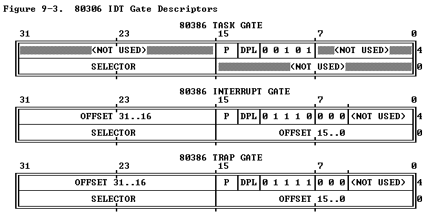

## IDT

[refer](https://www.scs.stanford.edu/05au-cs240c/lab/i386/s09_05.htm)

In 8086 used Interrupt Vector Table (IVT). It is just a list of 4-byte pointers (Segment:Offset) located at the very start of memory (0000:0000).

The 80386 replaced this with the Interrupt Descriptor Table (IDT). The 8086 was "open." Any program could change the IVT, which often led to system crashes. The 80386 introduces Protection. The IDT allows the operating system to define not just where the code is, but who is allowed to trigger it and how the processor should behave when it happens.

The IDT is an array of 256 "Gate Descriptors each 8-byte descriptors (Gates). While  8086 IVT was fixed at address 0, the IDT can live anywhere in the 4GB memory space. The CPU finds it using a special register called the IDTR (Interrupt Descriptor Table Register), which stores the table's base address and size.

When a hardware interrupt or a software exception occurs, the CPU uses an index to find the correct entry in this table. Each entry in the IDT is called a Gate

**Here is how those 8 bytes are broken down:**

* Offset (32 bits): Divided into two 16-bit chunks (the low bits at the start, the high bits at the end). This is the actual memory address of the Interrupt Service Routine (ISR).
* Segment Selector (16 bits): Unlike the 8086, which used a segment address, this points to an entry in the GDT (Global Descriptor Table). It tells the CPU which code segment to use.
    **Why the IDT must look for the GDT?**
    In the 8086, an interrupt vector simply contained a segment and an offset (CS:IP). However, the 80386 introduces Privilege Levels (Rings 0 through 3).

* Reserved (5 bits): Always set to zero.
* Gate Type (5 bits): Defines what kind of gate this is (Task Gate, Interrupt Gate, or Trap Gate).
* DPL (2 bits): The Descriptor Privilege Level. This is the security guard. It defines which "Ring" (0 through 3) is allowed to access this interrupt.
* P (1 bit): The Present bit. If this is 0, the CPU triggers an error because the code isn't currently in memory.

IDT contains any of these Task gates, Interrupt gates and Trap gates

**Why is it required? (What it solved)**
The IDT is necessary because the CPU must have a predefined, secure method to stop the current execution and jump to a specific handler when an unpredictable event occurs.
* Error Handling: If a "Divide by Zero" or "Page Fault" occurs, the CPU needs to know exactly which instruction to run next to address the error.
* Hardware Interaction: When a keyboard key is pressed or a network packet arrives, the hardware sends a signal. The IDT tells the CPU which code should process that signal.
* System Calls: User-level programs use software interrupts (like INT 0x80 in Linux) to request services from the operating system. The IDT provides the gateway to the kernel.

1. Security : On an 8086, any program could jump into an interrupt handler or overwrite the IVT. In the 386+, a program can only trigger an interrupt if it has the right Privilege Level (DPL). It ensures that code running in a restricted mode (Ring 3) cannot execute sensitive instructions unless the IDT explicitly allows a path to the kernel (Ring 0).
2. State Management: When an interrupt happens on an 8086, the CPU just pushes Flags, CS, and IP, It has single stack were user program and interrupt service handler will be working. On a 386+, the IDT works with the TSS to automatically switch to a secure "Kernel Stack," ensuring a user-mode crash doesn't break the interrupt handler.
3. Flexibility: It allows for different types of entries (Task, Interrupt, and Trap gates), each behaving differently regarding hardware interrupts and task switching.

**How it work?**
1. The CPU receives the interrupt vector (e.g., 13 for General Protection Fault). It multiplies this by 8 (the size of a descriptor) and adds it to the base address stored in the IDTR register.
    - Segment Selector: Extracted from the IDT entry.
    - Offset: Extracted from the IDT entry.
    - TI Bit: The CPU checks Bit 2 of the Selector. If 0, it uses GDTR; if 1, it uses LDTR.

2. The CPU treats the Segment Selector from the IDT as a pointer into the chosen table (GDT or LDT).
    - It retrieves the Segment Descriptor from that table.
    - This descriptor contains the Base Address and the Limit (size) of the code segment where the handler lives.

3. The CPU performs two specific checks:
    **If it is a hardware interrupt or CPU exception, the DPL check is ignored. Ring 0 switch must happens**
    - Gate Check: The CPL (the privilege of the code that was running) must be numerically less than or equal to the DPL of the IDT Gate. This prevents user-mode programs (Ring 3) from manually triggering sensitive hardware interrupts via the INT n instruction unless permitted.
    - Target Check: The CPL must be numerically greater than or equal to the DPL of the Target Code Segment (found in the GDT/LDT). 
    - Stack Switch: If the transition moves from User Mode (Ring 3) to Kernel Mode (Ring 0), the CPU consults the TSS to find the Kernel Stack pointer and switches to it.

4. The final linear address is calculated as: $$\text{Linear Address} = \text{Segment Base (from GDT/LDT)} + \text{Offset (from IDT)}$$

**The Gate Descriptors**

[Gate](./GDT.md#gates)

1. Interrupt Gate : This is used for hardware (like the system clock or keyboard).
2. Trap Gate      : This is used for software exceptions
3. Task Gate      : Hardware Multitasking

When a processor is running in Ring 3 (User Mode) and an event triggers an Interrupt Gate or a Trap Gate, a stack switch and a privilege level switch are always required.
Therefore, the CPU performs an automatic stack switch:
- The CPU consults the TSS (Task State Segment) to find the pre-defined ESP0 (the pointer for the Ring 0 stack).
- The CPU switches the SS (Stack Segment) and ESP (Stack Pointer) registers to this new kernel-owned memory.

When a User Program is running and an interrupt occurs, the CPU does not search the GDT for a new TSS. It uses the currently loaded TSS already sitting in the TR (Task Register). It have  SS0 and ESP0 fields CPU use this.

Task gate is not necessarly switch to only ring 0, it can switch to ring 0 to ring 0, ring 3 to ring 3 , Ring 3 to Ring 0 but ring 0 to ring 3  is not allowed must use IRET or far return

## TSS
[Refer](https://www.scs.stanford.edu/05au-cs240c/lab/i386/s07_01.htm)

In the 8086 era, if a program crashed or went into an infinite loop, the whole system froze. There was no "clean" way for the hardware to save exactly what one program was doing and instantly switch to another.

The TSS was created to solve Hardware Task Switching. It allowed the CPU to treat a "task" (a running program) as an object that could be paused and resumed.

Think of the TSS as a data structure in memory that acts as a snapshot. When the Operating System wants to switch from Task A to Task B, the CPU automatically "dumps" all the current register values into Task A's TSS and "loads" the values from Task B's TSS.

A TSS is a 104-byte block of memory

**What it solved:**
* Isolation: It prevented one program from accidentally using the registers or stack of another.
* Multitasking: It provided a hardware-level "save game" slot for the CPU's state.
* Privilege Levels: It helped the CPU manage the jump between "User Mode" (apps) and "Kernel Mode" (the OS) securely.

Modern linux almost stopped using TSS, only for kernel stack switch it uses 

When a User (Ring 3) program triggers an Interrupt Gate to enter the Kernel (Ring 0), the CPU refuses to use the user's stack (it might be full or malicious). The CPU looks inside the TSS to find the ESP0 (the "Known Good" Kernel Stack pointer). Without a TSS, the CPU would have nowhere to store data when moving from a low privilege to a high privilege, causing a "Triple Fault" (instant reboot).

## Task gate
- Task Gates in the GDT or LDT are for software-initiated task switching
- Task Gate in the IDT is specifically for exception-initiated task switching.
- The GDT and LDT are tables used by instructions (CALL, JMP). The IDT is the table used by events.

**Why required in IDT?**
- In a standard interrupt (using an Interrupt Gate), the CPU uses the current stack (if already in Ring 0) or switches to a new stack using the address in the TSS. Both methods require the CPU to push data onto a stack. **It is using current task's ring 0 stack**

- If the reason for the interrupt is that the stack itself is broken (a Stack Fault) or if the CPU is in a state where it cannot write to memory (a Double Fault), an Interrupt Gate will fail because the CPU cannot perform the initial "push" of the EFLAGS and Return Address. This results in a "Triple Fault," which causes the computer to instantly reboot.

- When an IDT entry is a Task Gate, the CPU does not use the current stack at all, even if current user stack is problem, interrupt can work in dedicated stack

- Faults like Double Fault, Stack Fault uses task gate in IDT

## Interrupts
Both the Interrupt and Trap gates share the same 8-byte format, but their "Type" bits differ.
- It must stored only in IDT, Because if a hardware interrupt or exeception occurs  CPU only look in interrupt table it is hardwired
- If you try to place a Trap Gate descriptor in the LDT and then call it using an INT instruction, the CPU will trigger a General Protection Fault.

Offset (0-15):	The lower 16 bits of the handler's address.
Selector :	The 16-bit Code Segment.
DPL :	Descriptor Privilege Level (Who can trigger this?).
Offset (16-31):	The upper 16 bits of the handler's address.

#### The Interrupt Gate
- The Interrupt Gate is designed primarily for Hardware Interrupts (like your Keyboard or System Clock).
- When a hardware device pulls the "Interrupt" pin on the CPU, the CPU looks up the Interrupt Gate and it automatically clears the IF (Interrupt Flag).
- While the interrupt can happen at any privilege level, the handler (the code that fixers the interrupt known as Target Segment) almost always runs in Ring 0. 
- Interrupt Gate can be a set to DPL ringe 3 but in a real operating system like Linux 0.12, no hardware interrupt gate is ever set to DPL 3 and it is not encourageable 

**Hardware Interrupts Ignore the DPL of the Gate**
- Software Interrupt: If a Ring 3 program tries to call a Ring 0 interrupt gate, the CPU checks the IDT Gate's DPL. If they don't match, it triggers a General Protection Fault.
- Hardware Interrupt: The CPU ignores the DPL of the IDT gate. Because hardware is "impartial," it is allowed to redirect the CPU to a Ring 0 handler regardless of what code was running at the time.
    If the CPU is in Ring 3 and a hardware interrupt moves it to Ring 0, the CPU cannot use the Ring 3 stack (it is untrusted and might overflow).
    - The CPU automatically looks into a special structure called the TSS (Task State Segment).
    - It finds the Ring 0 Stack Pointer (ESP0).
    - It switches to the Kernel Stack before saving the registers.

#### Trap gate
A Trap Gate is a descriptor that tells the CPU how to handle a "software-initiated" event, like an exception (division by zero) or a specific program request.

The biggest difference between a Trap Gate and an Interrupt Gate  is how they handle the "Interrupt Flag" ($IF$):
* Interrupt Gate: Automatically disables interrupts (clears $IF$) so no other hardware can bother the CPU while it's working.
* Trap Gate: Leaves the Interrupt Flag alone. Other hardware interrupts can still fire while the trap handler is running. If a program crashes (Trap), the kernel needs to handle it, but the system clock and keyboard should keep running in the background.

It is same as call gate. only few difference

[Complete flow](./interrupt_gate_flow.md)