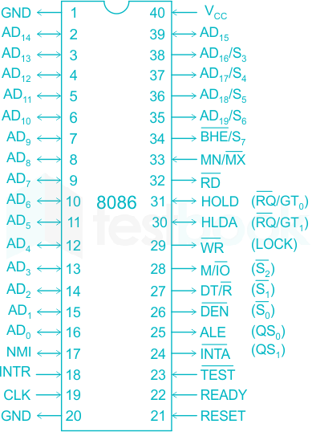

## Pin Diagram

Focusing only for minimum mode

## 8086 Pin Classification in Minimum Mode

| # | Category | Description | Primary Pins Involved | 
| :---: | :--- | :--- | :--- | 
| **1** | **Power & Clock** | Provide electrical power and the fundamental timing signal for the CPU. | $\text{VCC}, \text{GND}, \text{CLK}$ | 
| **2** | **System Management & Interrupts** | Handles CPU synchronization, arbitration, reset, and external interrupt control. | $\text{RESET}, \text{READY}, \overline{\text{TEST}}, \text{MN}/\overline{\text{MX}}, \text{NMI}, \text{INTR}, \text{HOLD}, \overline{\text{HLDA}}, \overline{\text{INTA}}$ |
| **3** | **Multiplexed Address/Data Bus** | Lines used for transferring both the 20-bit address and 16-bit data. | $\text{AD0-AD15}, \text{A16-A19}$ | 
| **4** | **Bus Cycle & Data Control** | Dedicated signals for defining bus transactions (Read/Write/I/O), handling byte selection, and managing data flow direction and timing. | $\overline{\text{BHE}}, \text{ALE}, \text{M}/\overline{\text{IO}}, \overline{\text{RD}}, \overline{\text{WR}}, \overline{\text{DEN}}, \text{DT}/\overline{\text{R}}, \text{S3-S6}$ |

### 1. Power & Clock 
* **$\text{VCC}, \text{GND}$** (Pins 40, 1, 20): Power supply and ground.
* **$\text{CLK}$** (Pin 19): The system clock input.

### 2. System Management & Interrupts
This group covers non-bus-cycle controls, arbitration, and interrupts.
* **CPU State:**
    * $\text{RESET}$ (Pin 21): Initializes the CPU.
      
      System Reset (Input): When this pin is held high and then returns low, it forces the 8086 to stop execution and restarts the program from memory address $\text{FFFF0H}$. It's essential for system startup.

    * $\text{READY}$ (Pin 22): Allows slow devices to insert **wait states**.

      Wait State Control (Input): Allows slow memory or peripheral devices to pause the CPU during a bus cycle. If the device set $\text{READY}$ low, the 8086 inserts wait states (idle clock cycles) until $\text{READY}$ goes high, ensuring the slow device has enough time to complete the data transfer.

    * $\overline{\text{TEST}}$ (Pin 23): Used with the $\text{WAIT}$ instruction.

      Wait for Test (Input, Active Low): This pin is checked by the $\text{WAIT}$ instruction. The CPU will pause execution after encountering the $\text{WAIT}$ instruction until the $\overline{\text{TEST}}$ pin is set low. It's used for synchronization with external hardware, often a coprocessor.

    * $\text{MN}/\overline{\text{MX}}$ (Pin 33): Must be $\text{VCC}$ for Minimum Mode.
      
      Mode Select (Input): Must be connected to VCC (Logic 1) to configure the 8086 to operate in Minimum Mode, allowing it to generate its own bus control signals.

* **Interrupts:**
    * $\text{NMI}$ (Pin 17): 
      
      Non-Maskable Interrupt (Input): A high-priority interrupt that is edge-triggered and cannot be ignored by the CPU. It is reserved for critical events like power failure. The CPU vector is fixed at address $00008\text{H}$.

    * $\text{INTR}$ (Pin 18):
      
      Interrupt Request (Input): A general-purpose, level-triggered, and maskable interrupt. The CPU only processes it if the Interrupt Flag ($\text{IF}$) is set. It requires an external Interrupt Controller (e.g., 8259A).

    * $\overline{\text{INTA}}$ (Pin 24): **Interrupt Acknowledge** output (responds to $\text{INTR}$).

      Interrupt Acknowledge (Output, Active Low): The CPU pulses this signal low twice to communicate with the external Interrupt Controller, signaling that it is ready to receive the interrupt vector number corresponding to the $\text{INTR}$ request

* **Bus Arbitration (DMA):**

    These two pins handle Direct Memory Access (DMA), allowing an external device (like a DMA Controller) to temporarily take control of the system bus for high-speed data transfer without CPU intervention.

    * $\text{HOLD}$ (Pin 31): **Hold Request** input from external master (DMA).
      
      Hold Request (Input): An external device (the DMA Controller) asserts this signal high to request control of the address, data, and control buses.

    * $\overline{\text{HLDA}}$ (Pin 30): **Hold Acknowledge** output (grants bus control).

      Hold Acknowledge (Output, Active Low): The 8086 asserts this signal low to acknowledge the $\text{HOLD}$ request, indicating that it has released control of the buses. The DMA controller can now use the bus until it drops the $\text{HOLD}$ signal.

### 3. Multiplexed Address/Data Bus (20 Pins)
These lines carry the address and data information sequentially.
* **$\text{AD0}$ - $\text{AD15}$** (Pins 2-16, 39): Lower 16 bits of Address/Data.

* **$\text{A16}/\text{S3}$ - $\text{A19}/\text{S6}$** (Pins 35-38, as address): Upper 4 bits of the Address.

The entire bus cycle relies on the time-division multiplexing managed by the $\text{ALE}$ signal:

1. Address Phase (T1): The $\text{ALE}$ (Address Latch Enable) signal goes high. During this time, all 20 lines ($\text{AD0-AD15}$ and $\text{A16-A19}$) carry the 20-bit physical address ($\text{A0-A19}$). External latches capture and hold this address based on the $\text{ALE}$ signal.

2. Data/Status Phase (T2, T3, T4): $\text{ALE}$ goes low.

    * The lower 16 lines ($\text{AD0-AD15}$) are released to carry the 16-bit data ($\text{D0-D15}$) being read or written.

    * The upper four lines ($\text{A16-A19}$) switch function and carry the internal Status Signals $\text{S3}$ through $\text{S6}$.
    

### 4. Bus Cycle & Data Control
This is the central group for managing all memory and I/O transfers, including the flow of data.

* **Address Timing:**
    * $\text{ALE}$ (Pin 25): **Address Latch Enable**. Signals when address is valid for latching.

        Address Latch Enable (Output): A pulse that occurs at the beginning of every bus cycle (Time state $\text{T1}$). It signals that the 20-bit address ($\text{A19-A0}$) is currently valid on the multiplexed lines ($\text{AD15-AD0}$ and $\text{A19-A16}$). External latches (e.g., $\text{74LS373}$) use $\text{ALE}$ to capture and hold the address for the remainder of the cycle, effectively demultiplexing the bus.

* **Bus Cycle Definition:**
    These signals define what type of transaction is happening and whether it's a read or a write. They are typically combined by external logic to generate four specific control strobes: memory read/write, IO read/write

    * $\text{M}/\overline{\text{IO}}$ (Pin 28): Selects **Memory** or **I/O** access.

        Memory/I/O Select (Output): Distinguishes the bus cycle target: Logic 1 ($\text{M}$) indicates a Memory access. Logic 0 ($\overline{\text{IO}}$) indicates an I/O Port access.

    * $\overline{\text{RD}}$ (Pin 32): **Read Strobe**. Signals a read operation.

        Read Strobe (Output, Active Low): Asserted low to indicate the CPU is performing a read operation. This pulse tells the selected memory or I/O device to place data onto the bus.

    * $\overline{\text{WR}}$ (Pin 29): **Write Strobe**. Signals a write operation.

        Write Strobe (Output, Active Low): Asserted low to indicate the CPU is performing a write operation. This pulse tells the selected memory or I/O device to capture the data currently on the bus.

* **Data Byte Selection:**
    * $\overline{\text{BHE}}$ (Pin 34): **Bus High Enable**. Used with $\text{A0}$ for byte/word transfer selection.

        | $\mathbf{\overline{BHE}}$ | $\mathbf{A0}$ | Data Pins Active | Transfer Type |
        | :---: | :---: | :---: | :--- |
        | **0** | **0** | $\text{D15-D0}$ | **16-bit Word**  |
        | **0** | **1** | $\text{D15-D8}$ | **High Byte** (Odd Address) |
        | **1** | **0** | $\text{D7-D0}$ | **Low Byte** (Even Address) |
        | **1** | **1** | None | No Transfer |

* **Data Flow Control (Steering):**

    These signals are used to manage the external data transceivers (or buffers) necessary to isolate and steer data on the system bus.

    $\text{DT}/\overline{\text{R}}$ and $\overline{\text{DEN}}$ are used by the DMA controller, but $\overline{\text{RD}}$ and $\overline{\text{WR}}$ are not directly used by it.

    * $\overline{\text{DEN}}$ (Pin 26): **Data Enable**. Turns on external data transceivers.

    * $\text{DT}/\overline{\text{R}}$ (Pin 27): **Data Transmit/Receive**. Sets data flow direction.

        Data Transmit/Receive (Output): Controls the direction of the data transceivers (buffers). Logic 1 ($\text{DT}$) sets the direction to Transmit (CPU $\to$ Bus), used for Write operations. Logic 0 ($\overline{\text{R}}$) sets the direction to Receive (Bus $\to$ CPU), used for Read operations.

* **Internal Status (Secondary Function):**
    * $\text{S3}$ through $\text{S6}$ (Pins 35-38, as status): Provide internal CPU state (segment register, $\text{IF}$ flag) *after* the address phase.

        - $\text{S3}, \text{S4}$: Status bits indicating which Segment Register ($\text{CS}, \text{DS}, \text{SS}, \text{ES}$) was used to generate the address.

            These bits are outputs from the 8086. External circuitry can monitor them to understand the nature of the current bus cycl

            | $\mathbf{S4}$ | $\mathbf{S3}$ | Segment Register Used | 
            | :---: | :---: | :--- |
            | 0 | 0 | ES |
            | 0 | 1 | SS |
            | 1 | 0 | CS or no-segment |
            | 1 | 1 | DS | 

        - $\text{S5}$: Status bit reflecting the state of the Interrupt Enable Flag ($\text{IF}$).

        - $\text{S6}$: Status bit which is always low (0), confirming the 8086 is the bus master.