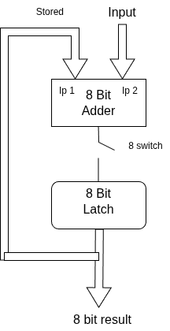
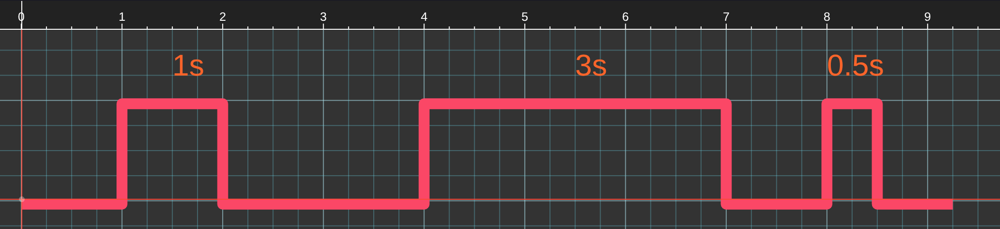
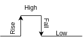
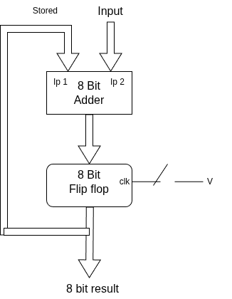

## How Clocks Turn Manual Logic into Automated Calculation?

### Prerequisites
* Basic Boolean algebra
* Basic understanding of logic gates

> [!NOTE]
> This blog explains these concepts in a simple way. Real CPUs are advanced and complex; to avoid confusion, I have used a simple "Adder" circuit as an example.

### How We Perform Addition

To understand how a computer works, let’s first look at how we add a list of numbers, such as [24, 34, 77].

1. We add the first two numbers: $24 + 34 = 58$.
2. We know that $58$ is not the final answer yet. We need to save this number, so we keep it in our **memory** or write it down. This is called an **intermediate result**.
3. We take that intermediate result (58) and add the final number to it: $58 + 77 = 135$.

In this process, we used our mind as a "memory" to hold the number 58

### Circuit design 

To perform this addition, let's design a simple circuit:

**Circuit Components:**
    1. 8-Bit Adder: This component has two inputs and calculates their sum.
    2. 8-Bit Latch: This is the "memory" of our circuit. A latch is a small circuit that stores 1 bit of data. By grouping 8 latches together, we can store an 8-bit number (like our intermediate result).
    3. 8-Bit Switch: This connects the Adder to the Latch. Imagine a single button that, when pressed, closes all 8 connections at once.

**Why do we need the 8-bit switch?**
    The switches are there to decide exactly when the result from the Adder should be sent to the Latch to be saved

The Addition Sequence using circuit

To add our numbers **[24, 34, 77]**, we follow these steps:

1. **Start:** Latch (memory) is `0`. We input `24`. Adder calculates $0 + 24 = 24$. We store `24` in the Latch by pressing the switch this close the circuit.
2. **Next:** Latch is `24`. Input is `34`. Adder calculates $24 + 34 = 58$. We store `58` in the Latch.
3. **Next:** Latch is `58`. Input is `77`. Adder calculates  $58 + 77 = 135$. We store `135` in the Latch.

This sounds perfect in theory, but in a real circuit, it won't work this way. 

**The Problem: How wrong could it go?**

The problem is that electricity travels incredibly fast. When you press the manual switch, the gate stays open for as long as your finger is on the button. Even if you press it for a tiny fraction of a second (like 0.1 seconds), the CPU sees that as a "High" signal for thousands of nanoseconds.

Because the output of the Latch is connected back into the Adder, a feedback loop occurs:

* **Time 0:** You press the button. Result = $0 (\text{memory}) + 24 (\text{input}) = 24$.
* **Time 1 (Still pressing):** The Latch sees the "High" signal is still there. It takes the new `24` from memory and adds the `24` from the input again. Result =  $24 + 24 = 48$.
* **Time 2:** It happens again! Result = $48 + 24 = 72$.

Before you can even lift your finger, the circuit has added the same number hundreds of times. Your answer becomes a giant, incorrect number instead of the 24 you wanted. This is called a **Feedback Loop Error**.

#### How to solve this issue?
The problem is that the circuit stays "open" for too long. To get the correct answer, we need the circuit to open only once per click. Even if you hold the button down for three seconds, the electricity should only pass through for a tiny fraction of a moment.

**Understanding the Button Press (scenerios)**

To see how the timing works, let's imagine you press the button three different times:
1. **First pres**s: You hold it for 1 second, then let go for 2 seconds.
2. **Second press**: You hold it for 3 seconds, then let go for 1 second.
3. **Third press**: You hold it for 0.5 seconds.

If we plot this on a graph, it looks like this:

In this graph:
* The High State (top) is when you are pressing the button.
* The Low State (bottom) is when the button is open (not pressed).

**The Problem with "High State"**
In our circuit, the addition happens during the High State. Because electricity is so fast, the Latch keeps saving and feeding data back into the Adder over and over again for the entire time your finger is on the button. Whether you press it for 3 seconds or 0.5 seconds, the computer performs thousands of "extra" additions that we don't want.

**The Four Stages of a Signal**

To fix this, we need to look closer at the "wave" created by your button press. Every cycle has four parts:

1. **Rising Edge**: The exact moment you press the button (0 to 1).
2. **High Level**: The duration while the button is held down.
3. **Falling Edge**: The exact moment you release the button (1 to 0).
4. **Low Level**: The duration while the button is not pressed.

The **Rising Edge** and **Falling Edge** happen only once per press, no matter how long you hold the button. If we make the circuit work only at the **Rising Edge**, we get exactly one addition per click.

This is the difference between a Latch and a Flip-Flop:
* Latch (Level Triggered): It is "active" the whole time you press the button. It is hard to control.
* Flip-Flop (Edge Triggered): It is an improved version of a latch. It only opens its "gate" at the exact moment of the Rising Edge.

**The Solution: Edge Triggering**

**Redesigning Our Circuit**
Now, let's fix the feedback error by redesigning our circuit with better components:

**The Upgrade**: In this new design, we replace the Latch with a Flip-Flop. We connect the output of the Adder directly to the input of the Flip-Flop and connect our button to the CLK (Clock) pin of the Flip-Flop.

Our sequence is 

1. **Start:** The Flip-Flop starts at `0`. We input  `24`. Adder calculates $0 + 24 = 24$. We store `24` in the Flip Flop by closing add circuit with Flip Flop (pressing the switch). Even if you hold the button down, the Flip-Flop only "grabs" the 24 at the exact moment the signal rises. It then ignores the rest of the press.
2. **Next:** Flip Flop now holds `24`. We input  `34`. Adder calculates $24 + 34 = 58$. We store `58` in the Flip Flop.
3. **Next:** Flip Flop now holds `58`. Input is `77`. Adder calculates  $58 + 77 = 135$. We store `135` in the Flip Flop.

Some of the circuits in CPU are made of flipflops `eg: counters`

### Automating the Process

Instead of a human pressing a button, we use a Clock Signal (a continuous square wave) to automate the entire process.

**Imagine we have numbers stored in memory. Here is how the Clock cycles through the work:**

1. The Adder Stage (Cycle 1)
* **Rising Edge**: The "Starter" signal. The inputs are pushed into the Adder.
* **High Level**: The Adder receives the numbers and begins the math.
* **Falling Edge**: The Adder is still working. Even though electricity is fast, it needs a moment to travel through all the gates.
* **Low Level**: The circuit waits. This gives the Adder enough time to ensure the result is 100% stable and correct.

2. The Capture Stage (Cycle 2)
* **Rising Edge**: The Flip-Flop "grabs" the finished result from the Adder and saves it. Simultaneously, the system moves to the next number in your list.
* High/Fall/Low Levels: The system prepares for the next round of addition.

**The Brain: The Control Unit**

In a real CPU, there is a special part called the Control Unit. It acts like a conductor in an orchestra. Using an internal counter, it keeps track of the clock cycles and tells every part of the computer exactly when to "push" data and when to "save" it.

>**Adder circuit is not a edge\level trigger**   
> Unlike latches or Flip-Flops, an adder does not have a "Clock" pin. It doesn't wait for a signal to tell it to start adding. It is always on
>- How it works: As soon as you change the inputs ($input$ or $flipflop$), the output ($Sum$) starts changing immediately.
>- The Delay: The only reason the output isn't "instant" is because of Propagation Delay (the physical time it takes electricity to travel through all the transistors inside add logic). 
> We must make sure our Clock isn't too fast, or the Flip-Flop might try to save the answer before the Adder has finished the math!

### The Step-by-Step Cycle Process

To add our numbers **[24, 34, 77]**, the computer breaks the work into cycles. Each cycle follows the "heartbeat" of the clock.

#### 1. Adding the first number: 

* **Cycle 1 (The Work):**
    * **Rising Edge:** The Flip-Flop starts at `0`. The system pushes `0` and the first input (`24`) into the Adder.
    * **High/Falling/Low Levels:** The Adder performs the math. System wait during the "Low Level" to ensure the **Propagation Delay** is over and the result (`24`) is stable.

* **Cycle 2 (The Save):**
    * **Rising Edge:** The Flip-Flop captures the `24` from the Adder. The **Control Unit** then selects the next number (`34`) for the next step.
    * * **High/Falling/Low Levels:** Nothing 

#### 2. Adding the second number: 

* **Cycle 3 (The Work):**
    * **Rising Edge:** The Flip-Flop (now holding `24`) and the new input (`34`) are sent to the Adder.
    * **High/Falling/Low Levels:** The Adder works through the complexity. By the end of the Low Level, the result `58` is ready.

* **Cycle 4 (The Save):**
    * **Rising Edge:** The Flip-Flop captures `58`. The Control Unit selects the final number (`77`).

#### 3. Adding the final number: 

* **Cycle 5 (The Final Work):**
* **Rising Edge:** The Flip-Flop sends `58` and the input `77` to the Adder.
* **High/Falling/Low Levels:** The Adder completes the calculation.

* **Cycle 6 (The Final Result):**
* **Rising Edge:** The Flip-Flop captures the final total: **135**.

### Controlled Automation

By the end of these cycles, the addition is perfectly finished. This is **Controlled Automation**. Because every step has its own specific "moment" on the clock wave, the operations never collide or interfere with each other. This is the primary job of the Clock: **Synchronization**.

### How do we choose the Clock Speed?

We must choose our clock speed based on the **slowest** circuit in the system. In our example, the Adder is the most complex part. If we set the clock too fast, the Flip-Flop might try to capture the data before the Adder has finished its work.

We must guarantee that the "Low Level" of our clock is long enough to cover the **Propagation Delay** of the Adder. This ensures that every result captured is 100% accurate.

--- 
There are some option in choosing the clock
**1. Duty Cycle Adjustments**
During High level electricity flow into the circuit like adder but the results are not stable (Based on the carry bit electricity flow may change), think of this stage is only to pass the electricity, in low level stage it will get enough time to settle the result
- in high stage electricity is flow into the circuit, but result are not stabe
- in the end low level result will be stage

for some circuits flow of electricity is faster but stable will take time, in this case we should choose clock like high stage is lower than the low stage like (10% duty cycle, high stage only have 10% time of cycle, low stage will have 90% time)
if flow and stable take same amout of time then it is 50% duty cycle
high stage hev 50% of the cycle and low stahe have 50% of the cycle

**2. Frequency Divisor**
If the whole system is too fast, we use a frequency divisor to slow down the "heartbeat" of the CPU so every component can keep up.

**3. The "Wait" State**
What if the component is *really* slow (like external RAM)?
In this case, the component sends a "Wait" signal to the CPU. The CPU will stop and "idle" on a specific part of the clock cycle until the component says, "I am done!" Then, the CPU continues to the next stage.