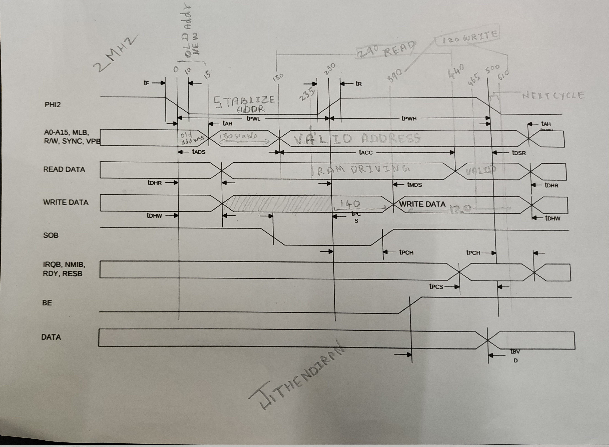
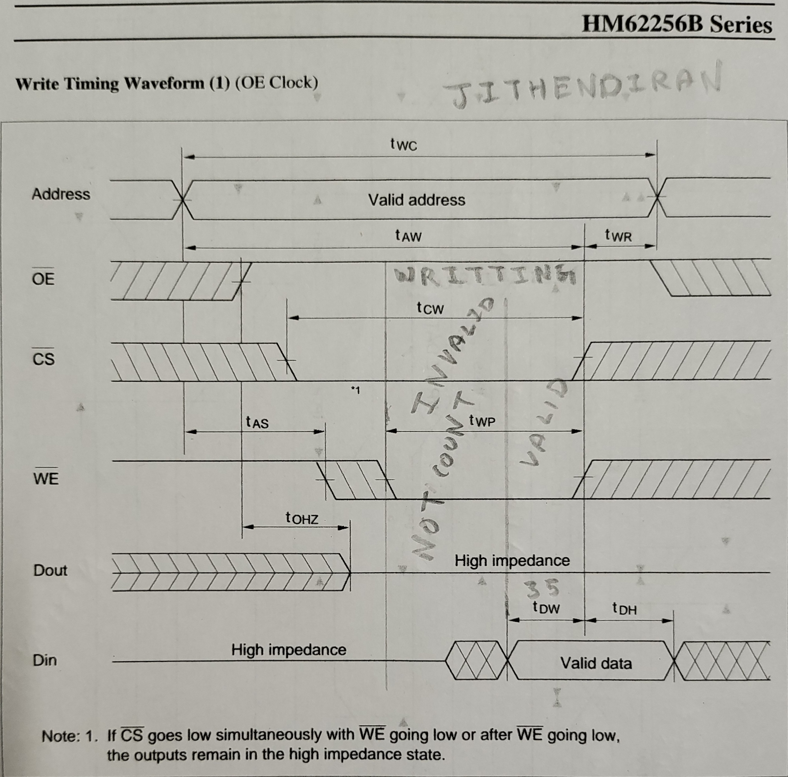

## Timing diagram analysis
Timing diagram analysis explaination, It is assumed MPU is dircetly connected to RAM,
If there are any address decoders or circuits in between we have to consider it's propogation delay

* Min = This is the shortest time the CPU needs to stay "still" for things to work.

* Max = This is the slowest the CPU will be.

* Usually ignore $Typ$ if given in the datasheet for calculation

For this study we will using static DRAM

### MPU W65C02S
[w65c02s](https://www.westerndesigncenter.com/wdc/documentation/w65c02s.pdf)

Let's take 2MHz for sample calculation

* Address BUS active from Fall edge
* Data BUS active from Rise edge

**Timing scale**

1. Convert Megahertz to Hertz: $$2\text{ MHz} = 2 \times 10^6\text{ Hz} = 2,000,000\text{ Hz}$$
2. Calculate the period in seconds: $$T = \frac{1}{2,000,000\text{ Hz}} = 0.0000005\text{ seconds}$$
$$T = 5 \times 10^{-7}\text{ s}$$
3. Convert seconds to nanoseconds: Since $1\text{ second} = 10^9\text{ nanoseconds}$:
    $$T = (5 \times 10^{-7}) \times 10^9\text{ ns}$$
    $$T = 500\text{ ns}$$

> BE pin is enabled for all operation

#### Clock analysis
0 is taken from the falling edge

| Time (ns) | Event / State | Logic Phase |
| --- | --- | --- |
| **0** | **50% of Falling Edge** | **Cycle Starts ($T_f$)** |
| 1 – 2 | Finish Falling to Low | Low edge ($T_f$). 3/5 sec in fall time| 
| 3 – 247 | **Low Level** | Low  level ($T_{PWL}$)|
| 248 | Start of Rising Edge | Transition, 2/5 sec in rise time (248, 249)|
| **250** | **50% of Rising Edge** | **Mid-cycle ($T_{r}$)** |
| 251 – 252 | Finish Rising to Low | High edge ($T_r$) 3/5 sec in rise time (250, 251, 252)|
| 253 – 498 | **High Level** | High level ($T_{PWH}$)|
| 499 | Start of Falling Edge | Transition |
| **500** | **50% of Falling Edge** | **Next Cycle Starts** |

* $t_{BVD}$ (max) = Once data is started diving in BUS, BUS need maximum of 30 ns to give the correct value 

* $t_{ADS}$ (max) = mpu need 150 ns to put the stable address in address bus, after 150ns address is stable

* $t_{AH}$ (min) = Data read/write from/to memory happen at fall edge, so address must hold for atleast 10ns

* $t_{ADS}$ (new address) and $t_{AH}$ (old address) has a overlapping period for 10ns at starting of the clock cycle

**Address is valid from 150ns to 510ns = 510-150 = 360ns**

> MPU doing double duty during time 0-10ns, It will put new/current address on address bus, it might take minimum of 10ns to reach address bus, during that time old/ previous address is on the address bus, using this it will do the read and write operation

#### Read timing
Address flowing in the address BUS from fall edge (0), Data read from the memory at fall edge (500)

* $t_{ACC}$ (min) = After address stabled, MPU expect data operation within 290ns

* $t_{DSR}$ (min) = Before fall clock edge arrive, data must be stable for atleast 60ns

* $t_{DHR}$ (min) = Data must be hold for atleast 10ns after the fall edge, for MPU to access latch the data properly

**Memory unit available time**

* Since memory unit is not depend on the clock, it will start receiving the valid address from t=150ns
* MPU expected the data must for stable for atleast 60ns before read, read is happening at T=500ns, so 500-60 = 440ns
* Time period for memory unit MPU provide is T = 440ns-150ns = 290ns

**General formula**
$$t_{ACC} = t_{CYC} - (t_{ADS} + t_{DSR})$$
$$500\text{ns} - (150\text{ns} + 60\text{ns}) = 290\text{ns}$$

**Address available from 150 to 510 for 360ns**

#### Write timing
Address flowing in the address BUS from fall edge (0), Data read from the memory at fall edge (500)

* $t_{MDS}$ (max) = MPU takes 140ns after the rise edge to provide stable data

* $t_{DHW}$ (min) = MPU must hold the data after the fall clock edge for 10ns

* Since memory unit is not depend on the clock, it will start receiving the valid address from t=150ns

* MPU start driving data from rise edge, MPU need 140ns to put the valid data on the data bus `rise edge = 250` 250 + 140 = `390`
* From 390 - 510 valid data is driving from the MPU `510-390 = 120`, during this 120 Memory should grab the data and write to the storage cell

**Address available from 150 to 510 for 360ns, Data available from 390 to 510 for 120ns**

### RAM HM62256B
We will use [HM62256B](https://web.mit.edu/6.115/www/document/62256.pdf) Asynchronous Static RAM (SRAM), it does not use a clock signal to synchronize its operations. 

Let's take -8 for sample calculation

#### Read timing
The RAM chip begins internal processing the moment the Address is stable. However, the output buffers are controlled by Chip Select ($\overline{CS}$) and Output Enable ($\overline{OE}$).

* $\overline{WE}$ set to high

* $t_{RC}$ min = This is the total time from the start of one address being valid to the start of the next address being valid. In your 2MHz system, this is 500ns. The chip require minimum of 85ns to valid address to select the memory units.

* $t_{AA}$ (max)  = This is the Maximum time RAM chip would take to provide the data from the valid address

* $t_{ACS}$ (max) = This is the chip select, without this chip won't selected, so it has to active for whole duration, This pin should be in active state from address become valid

* $t_{OE}$ (max)  = (45ns)It is much faster (45ns) because it only controls the "shutter" on the output pins; it doesn't control the internal memory "lookup." Till $t_{AA}$ complete it might provide garbage value

* $t_{OH}$ (min)  = How long the data stays on the bus after the address changes 10ns (When the CPU changes the address to read a new byte, the RAM doesn't instantly delete the old data. There is a tiny "grace period" where the old data stays on the wires.)

* Address should be valid before $t_{AA}$ and $t_{OE}$ goes low

* Address must valid till valid data available to databus till setup time, after address change, data is valid for minimim of 10 ns $t_{OH}$  

* RAM chip require 85ns  

* $t_{OH}$ <= MPU's $t_{DHR}$, 10 <= 10 (This is important time because, 500ns $t_{OE}$, $t_{ACS}$ will be low but MPU needs to access the data it must give valid data till MPU's required hold time)

* MPU time budget is 290ns > RAM required is 85ns, so it is good match

#### Write timing

> Data will start write to RAM at time when  $\overline{CS}$ and $\overline{WE}$ both are in low state (overlapping period), during this period address must be valid and data should provide with in this time period, It is not expected to give the data for whole overlapping period, The data must be a valid one before RAM stops writing and it should be stable (achieve setup time) 

> Data write will stop when  $\overline{CS}$ or $\overline{WE}$ goes high, data must stable for hold time, because gates are not closed As Soon As pins go high.

* $t_{WC}$ (min) = The minimum time from the start of one write to the start of the next = 85ns

* $t_{AS}$ (min) = The time the Address must be stable before the $\overline{WE}$ and $\overline{CS}$ goes low = 0ns (meaning they can happen at the same time)

* $t_{AW}$ (min) = The total time the Address must stay stable from the start of the write pulse until the start of stop writing(gates won't close instant). ($\overline{WE}$ or $\overline{CS}$ goes high) = 75ns

* $t_{CW}$ (min) = The time from $\overline{CS}$ going low until the end of the write pulse (chip select pin) = 75ns

* $t_{WP}$ (min) = This is how long the $\overline{WE}$ pin must be held Low. The RAM needs this "pulse" to be long enough to flip the internal bits. This must be enabled after the address is table and chipselect is active state (low) = 55ns

* $t_{DW}$ (min) = How long the Data must be stable on the bus before $\overline{WE} $ or $\overline{CS}$ goes high. This has to sync with MPU setup time. = 35ns

* $t_{DH}$ (min) = How long the data must stay on the bus after $\overline{WE}$ goes back high. This has to sync with MPU hold time =  0ns.

* $t_{WR}$ (min) = The time the Address must stay stable after $\overline{WE}$ goes high. This prevents writing to wrong address. = 0ns

Here $t_{DH}$ is 0 which mean write will done instant 

**Why CW pin must stay open for long, even the data setup time is half of it?**
This migh due to propogation delay, $t_{CW} / t_{WP} = 75\text{ ns}$: This is a power and stability requirement. Inside the RAM, each bit is a "flip-flop" (usually 6 transistors). To change  0 to  1, you are literally fighting the existing state of that flip-flop.

**Sequence** 
1. Set Address: $A_0 - A_{14}$ must be stable.
2. Wait $t_{AS}$: (Even if it's $0\text{ ns}$, ensure no "glitches").
3. Trigger Write: Pull $\overline{WE}$ and $\overline{CS}$ Low. This starts the $t_{WP}$ period.
4. Hold Data: Apply your data to the $I/O$ pins.
5. End Write: Pull $\overline{WE}$ or $\overline{CS}$ High. The time from the start of step 1 to this moment must be at least $t_{AW}$.

Data must stable from 75 - $t_{DW}$ = 75-35 = 40ns

| Time (ns) | State | Importance |
| --- | --- | --- |
| $t = 0$ | Addresses Valid. $\overline{CS}$ & $\overline{WE}$ go Low. | Starts the cycle. $t_{AS}=0$ is met. |
|$t = 0 $ to $20$| Propogation delay | Data pin in High-Z|  
| $t = 20$ to $40$ | Data pin transitioning / High-Z. | RAM is active, but internal latch hasn't stabilized yet. |
| $t = 40$ | **Data Must be Stable.** | This starts the $35\text{ ns}$ "Data Setup" ($t_{DW}$) window. |
| $t = 40$ to $75$ | **The Critical Write Window.** | Everything (Address, $\overline{CS}$, $\overline{WE}$, Data) must remain frozen. |
| $t = 75$ |  $\overline{WE}$ and/or $\overline{CS}$ goes High. | **The Capture Point.** The value on the data bus at this exact nanosecond is what stays in memory. |
| $t > 75$ | Address and Data can change. |  $t_{DH}=0$ and $t_{WR}=0$. Only thing important is  $\overline{WE}$ and/or $\overline{CS}$ should go High before data and address become invalid|

The above time line must sync with rise edge of the MPU clock (0 == 250)

It require 75-85ns for operation to complete
* MPU's budget is `120` >= `85` ns

* RAM hold time 0 <= MPU hold time 10

* Even $t_{DH}=0$ and $t_{WR}=0$ is 0 we must ensure $\overline{WE}$ and/or $\overline{CS}$ should go High before data and address become invalid, ($\overline{WE}$, $\overline{CS}$, DATA and address)all should not become invalid at the same time 
tldr : make the  $\overline{WE}$ or $\overline{CS}$ high before data and address become invalid

## Analysis

### Memory read cycle

* t = 1 - 5 (fall edge)
    - Start Data read operation (old read) (MPU $\leftarrow$ Memory)
    - MPU started generating the next address

* t = 10ns (Hold time ends)
    - Now previous Data is guarenteed to be readed by MPU
    - We can believe it would take 10ns (0-10) for new address to change the state of internal transistor, before driving the next address to address bus, so old address is stable in bus during 0-10 ns

* t = 150 ns
    - new/current Address is stabilized on address BUS (tADS)
    - It will take 150 ns for stabilization 
    - Address is driving
    - RAM started working

* t = 150 + 85 = 235ns
    - RAM completed the working and start driving the data in the data bus
    - it will drive till the input address for RAM chip change

* t = 250 (Rise edge)
    - Address is driving from MPU
    - Data is driving from RAM

* t = 440 (440-150 (Address stable) = 290)
    - Tacc completed, now MPU Expect the data should be stable on the data bus 
    - Time for Data setup DSR(t = 440 - 500 = 60 ns)
    - MPU started latching

* t = 500ns (fall edge)
    - MPU start capturing the data

(Next cycle)
* t = 510ns (tDHR)
    - Data read completed
    - get new address
* t = 515ns 
    - Data from the data bus is back to high impendence state

### Memory write cycle

* t = 1 - 5 (fall edge)
    - Start Data write operation (MPU $\rightarrow$ Memory)
    - MPU started generating the next address
* t = 10ns (Hold time ends)
    - Now previous Data is guarenteed to be written by Memory
    - We can believe it would take 10ns for new address to change the state of internal transistor, before driving the next address to address bus, so old address is stable in bus

* t = 150ns
    - tADS completed
    - Address is stabilized on address BUS
    - It will take 150 ns for stabilization 
    - RAM chip $t_{AS}$ is 0 so RAM chip address get stablized from 150th ns

* t = 151 - 249ns 
    - Address is driving

* t = 250 (Rise edge)
    - Address is driving
    - CS pin and WE pin goes low, OE goes high
    - write data stabilization start

* t = 390ns (250+140 = 390ns)
    - Data is stable in Data bus.  ($t_{MDS}$).

* t = 390 - 465
    - during this time write will happen, but won't count

* t = 465ns (500 - 35 = 465ns)
    - RAM Data Setup Deadline. For an 85ns RAM, $t_{DW}$ is 35ns. Data must be stable 35ns before $\overline{WE}$ goes High.

* t = 500ns (fall edge)
    - CS pin and WE pin goes high, OE goes low, which mean RAM chip is stop writing
    - DATA $t_{DH} = 0$ and Address $t_{WR} = 0$ should be valid for minimum amount of time

* t = 500-510
    - Data is valid in data bus
(Next cycle)
* t = 510ns (tDHW)
    - Data write completed
    - get new address

Since data is stable at 390ns and the write ends at 500ns. the data is stable for 110ns, which is much greater than the 35ns required.

### Slow memory 

**What if memory unit need more time?**

- If memory unit need more time disable `RDY` pin
- During fall edge depends on the `RDY` pin, MPU will wait for new data
- Hardware designer will design a Wait State Generator circuit, it will set the `RDY` pin low or high
- tPCS = 60 ns, before fall edge, `RDY` pin should be stabilized before 60ns
- tPCH = 10 ns, `RDY` pin has to be stable for atleast 10 ns, after fall edge

### Todo
for modern DRAM
- Look up "SRAM vs DRAM": Learn why modern RAM needs to be "Refreshed" every few milliseconds.
- DDR (Double Data Rate): Data is transferred on both the rising and falling edges of the clock.
- Differential Clocking: DDR doesn't use one clock wire; it uses two ($CK$ and $\overline{CK}$) that are opposites. The RAM looks for the exact moment they cross each other
- Row/Column Addressing: You can't just send one 16-bit address. You must send a Row Address, wait ($t_{RCD}$), then send a Column Address.
- Prefetch: When you ask for 1 byte, the RAM actually grabs 8 bytes (DDR4) or 16 bytes (DDR5) internally because the internal memory cells are much slower than the external pins.
- The Data Strobe ($DQS$): In your 6502 study, the CPU provides the clock. In DDR, the RAM provides its own clock ($DQS$) back to the CPU when it sends data. This ensures the data and the "latch signal" arrive at the CPU at the exact same time, accounting for wire length.
- Termination (ODT): At these speeds, signals "bounce" off the end of wires. DDR4 has internal resistors to "soak up" the electricity so it doesn't reflect back and cause errors.
- ZQ Calibration: The RAM literally measures its own internal resistance and adjusts it to match the temperature of the room.
- Read/Write Leveling: The CPU sends test patterns to the RAM to measure how many picoseconds it takes for the signal to travel down the motherboard traces, then adds tiny delays to compensate.
- Explore the 65816 or 68000: These are "next step" CPUs that use Bus Multiplexing (sharing wires), which is a bridge to modern tech.
- https://www.alldatasheet.com/datasheet-pdf/view/351794/MICRON/MT46V16M16.html

## Refer
* [Youtube](https://www.youtube.com/watch?v=i_wrxBdXTgM)
* [Youtube](https://www.youtube.com/watch?v=Vq0x-ic9q04)