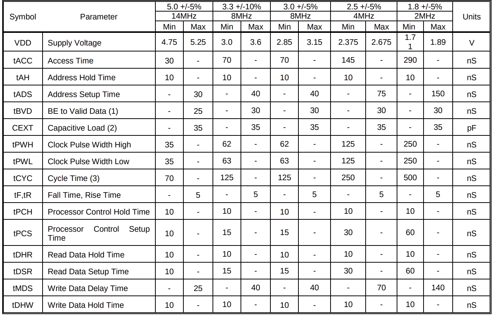
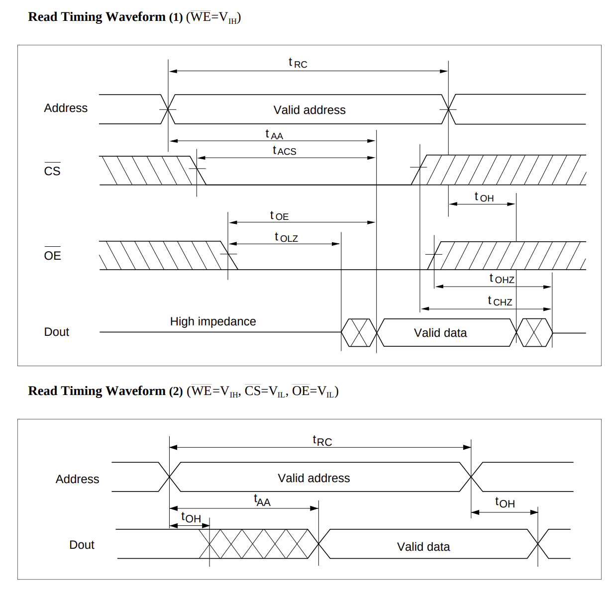
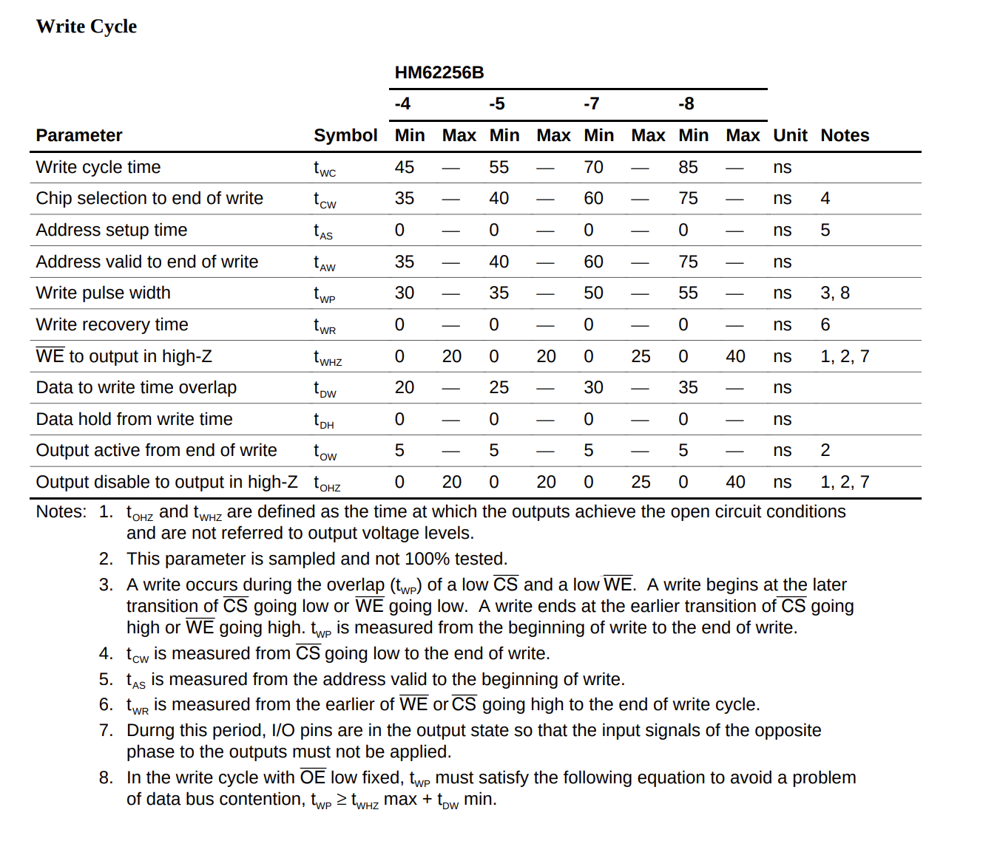

## Timing diagram analysis
Timing diagram analysis explaination

### MPU W65C02S
[w65c02s](https://www.westerndesigncenter.com/wdc/documentation/w65c02s.pdf)

Let's take 2MHz for sample calculation

### RAM HM62256B
We will use [HM62256B](https://web.mit.edu/6.115/www/document/62256.pdf) Asynchronous Static RAM (SRAM), it does not use a clock signal to synchronize its operations. 

Let's take -8 for sample calculation

$t_{RC}$ min = The total time a read operation must take

$t_{AA}$ max = From address stable till data become valid

$t_{ACS}$ max = chip select time maximum of

$t_{OE}$ = How long after OE goes Low until Data is valid.

$t_{OH}$ = How long the data stays on the bus after the address changes

From the stable address it need 85ns to provide the data

## Analysis

Min = This is the shortest time the CPU needs to stay "still" for things to work.

Max = This is the slowest the CPU will be.

Usually ignore $Typ$ if given in the datasheet for calculation

| Time (ns) | Event / State | Logic Phase |
| --- | --- | --- |
| **0** | **50% of Falling Edge** | **Cycle Starts ($T_f$)** |
| 1 – 2 | Finish Falling to Low | Low edge ($T_f$). 3/5 sec in fall time| 
| 3 – 247 | **Low Level** | Low  level ($T_{PWL}$)|
| 248 | Start of Rising Edge | Transition, 2/5 sec in rise time (248, 249)|
| **250** | **50% of Rising Edge** | **Mid-cycle ($T_{r}$)** |
| 251 – 252 | Finish Rising to Low | High edge ($T_r$) 3/5 sec in rise time (250, 251, 252)|
| 253 – 498 | **High Level** | High level ($T_{PWH}$)|
| 499 | Start of Falling Edge | Transition |
| **500** | **50% of Falling Edge** | **Next Cycle Starts** |

### Memory read cycle

Address start flowing in the address BUS from fall edge, Data read from the memory at fall edge 

$t_{ADS}$ (max) = Cpu need 150 ns to put the stable address in address bus, after 150ns address is stable

$t_{ACC}$ (min) = from the clock rise edge, MPU expect data within 290ns

$t_{AH}$ (min) = Data read from memory happen at fall edge, so address must hold for atleast 10ns

$t_{BVD}$ (max) = Once data is started diving in BUS, BUS need maximum of 30 ns to give the correct value 

Data must be stable before the next fall edge

$t_{DSR}$ (min) = Before fall clock edge arrive data must be stable for atleast 60ns

$t_{DHR}$ (min) = Data must be hold for atleast 10ns after the fall edge, for MPU to access latch the data properly

BE pin is enabled for all operation

Both address and data operations are happen at the fall edge, during rise edge Memory chip start's it operations

* MPU provides stable address by 150ns.
* The RAM starts working at 150ns. It needs $t_{AA}$ (85ns) to put data on the bus. $150\text{ns} + 85\text{ns} = 235\text{ns}$.Data is guaranteed stable on the bus at 235ns.
*  The MPU doesn't need the data until the falling edge (500ns) minus its setup time $t_{DSR}$ (60ns), which is 440ns.

#### Clock cycle 
* t = 1 - 5 (fall edge)
    - Start Data read operation (MPU $\leftarrow$ Memory)
    - MPU started generating the next address

* t = 10ns (Hold time ends)
    - Now previous Data is guarenteed to be readed by MPU
    - We can believe it would take 10ns (0-10) for new address to change the state of internal transistor, before driving the next address to address bus, so old address is stable in bus

* t = 150 ns
    - Address is stabilized on address BUS (tADS)
    - It will take 150 ns for stabilization 
    - Address is driving
    - RAM started working

* t = 150 + 85 = 235ns
    - RAM completed the working and start driving the data in the data bus
    - it will drive till the input address for RAM chip change

* t = 250 (Rise edge)
    - Address is driving
    - Data is driving from RAM

* t = 440 (440-150 (Address stable) = 290)
    - Tacc completed, now MPU Expect the data should be stable on the data bus 
    - Time for Data setup DSR(t = 440 - 500 = 60 ns)
    - MPU started latching

* t = 500ns (fall edge)
    - MPU start capturing the data

(Next cycle)
* t = 510ns (tDHR)
    - Data read completed
    - get new address
* t = 515ns 
    - Data from the data bus is back to high impendence state

#### Calc

* Address should be valid for 150 - 510 ns = 360ns
* Memory unit available time = (start of DSR)440 - (start of Tacc)150 = 290ns 
Memory unit have 290ns time, with in this time period it has to provide the data
$$t_{ACC} = t_{CYC} - (t_{ADS} + t_{DSR})$$
$$500\text{ns} - (150\text{ns} + 60\text{ns}) = 290\text{ns}$$

* RAM chip timing = 85ns, $85ns < 290ns $ so timing is with in the range

### Memory write cycle

Data write happen at fall edge, data should be available before the fall edge

tMDS (max) = MPU takes 140ns to write the data on the data bus

tDHW (min) = MPU must hold the data after the fall clock edge

MPU need 140 ns to stabilize the write data, 500 - 140 = 360 ns, From 360 ns data should be stable and available for memory unit to consume 

Atleast from 360 ns data should be stable

data must be available for 10ns after the clock hit 140 + 10 = 150 ns

Things to note
* Data is written to RAM chip when CS and WE pin goes from low to high at the same time, during that time address must be valid
* As per MPU time line at the 500ns it is expected to write the data to RAM, so it is expected to both CE ans WE must go high at the 500ns
* tCW (cs) = 75
    - 500 (data expected to write) - 75 =   425 ns atleast at this time cs must go low
* tWP (we) = 55
    -  500 (data expected to write) - 55 =   445 ns atleast at this time we must go low

#### Clock cycle 
* t = 1 - 5 (fall edge)
    - Start Data write operation (MPU $\rightarrow$ Memory)
    - MPU started generating the next address
* t = 10ns (Hold time ends)
    - Now previous Data is guarenteed to be written by Memory
    - We can believe it would take 10ns for new address to change the state of internal transistor, before driving the next address to address bus, so old address is stable in bus

* t = 150ns
    - tADS completed
    - Address is stabilized on address BUS
    - It will take 150 ns for stabilization 

* t = 151 - 249ns 
    - Address is driving
    - MPU my start writing the data

* t = 250 (Rise edge)
    - Address is driving
    - write data stabilization

* t = 360ns (500-140 = 360ns)
    - Data may be stable before 360, but data write happen at fall edge, This is like setup time
    - Now data must be stable in data bus

* t = 500ns (fall edge)
    - Memory start capturing the data from the bus

(Next cycle)
* t = 510ns (tDHW)
    - Data write completed
    - get new address

### Slow memory 

**What if memory unit need more time?**

- If memory unit need more time disable `RDY` pin
- During fall edge depends on the `RDY` pin, MPU will wait for new data
- Hardware designer will design a Wait State Generator circuit, it will set the `RDY` pin low or high
- tPCS = 60 ns, before fall edge, `RDY` pin should be stabilized before 60ns
- tPCH = 10 ns, `RDY` pin has to be stable for atleast 10 ns, after fall edge

### Todo
for modern DRAM
- Look up "SRAM vs DRAM": Learn why modern RAM needs to be "Refreshed" every few milliseconds.
- Look up "SDRAM State Machine": See how a "Command" (Activate, Read, Precharge) replaces a simple "Address."
- Explore the 65816 or 68000: These are "next step" CPUs that use Bus Multiplexing (sharing wires), which is a bridge to modern tech.

## Refer
* [Youtube](https://www.youtube.com/watch?v=i_wrxBdXTgM)
* [Youtube](https://www.youtube.com/watch?v=Vq0x-ic9q04)